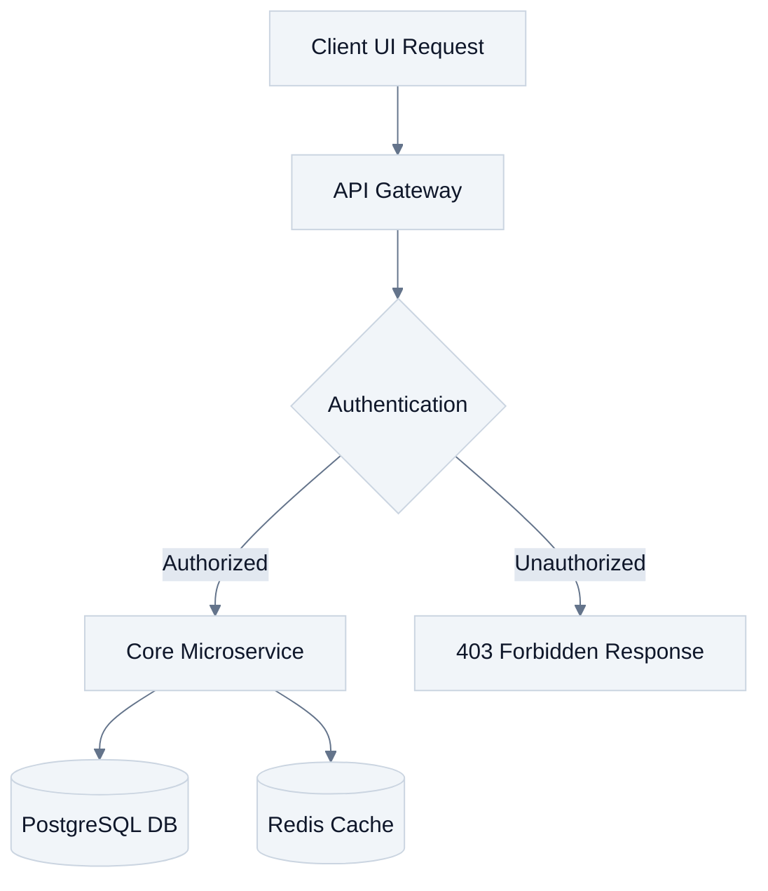
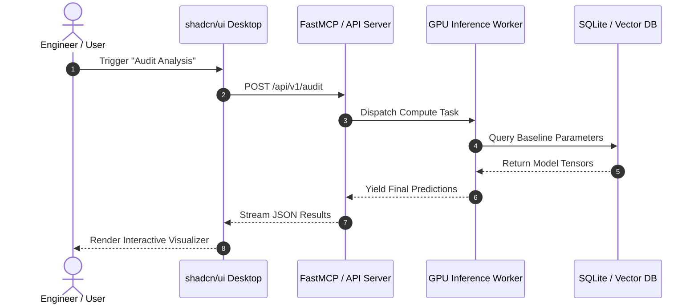

# Mermaid Charts — Structured Technical & Architecture Diagramming

Mermaid generates diagrams and visualizations using text-based markdown definitions. It integrates seamlessly into GitHub, GitLab, Notion, and Markdown documentation.

---

## 1. Professional Styling Principles

Default Mermaid charts often look garish with bright cyan and pink nodes. Always enforce clean, minimalist themes:

---

## 2. Supported Diagram Types & Use Cases

1. **Flowcharts (`flowchart TD / LR`)**:
   - Algorithmic branching, business logic workflows, user journeys.
2. **Sequence Diagrams (`sequenceDiagram`)**:
   - Microservice communication, API handshakes, asynchronous message queue handling.
3. **State Diagrams (`stateDiagram-v2`)**:
   - Order processing states, sensor connection states, finite state machines.
4. **Class & Entity-Relationship (`classDiagram`, `erDiagram`)**:
   - Database schemas, Object-Oriented software architectures.
5. **Gantt Charts (`gantt`)**:
   - Software sprint timelines, research project milestones, delivery phases.

---

## 3. Standard Architecture Pattern Example

